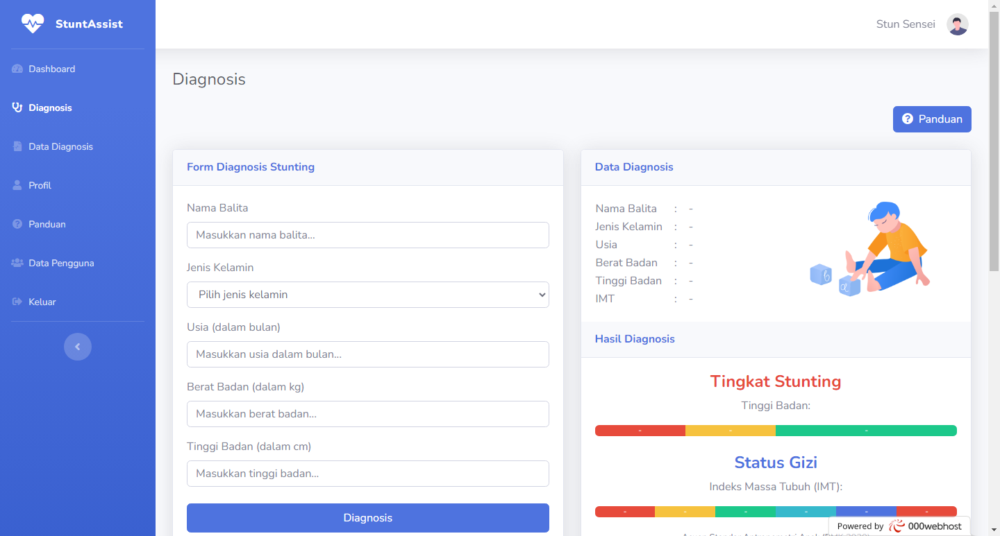

# 🍎 StuntAssist: Aplikasi Diagnosis Stunting 🌱

StuntAssist adalah aplikasi yang memberikan diagnosis cepat, akurat, dan rekomendasi relevan untuk mendukung pertumbuhan dan perkembangan anak dengan optimal pada kasus stunting.

## 🚀 Fitur Utama
- **Diagnosis:** Melakukan diagnosis cepat untuk menentukan status stunting anak.
- **Kelola Data Diagnosis:** Menyimpan dan mengelola riwayat diagnosa stunting anak.
- **Tampilan Perkembangan Grafik Stunting:** Menampilkan grafik perkembangan stunting anak untuk pemantauan visual.
- **Informasi Penanganan:** Memberikan informasi dan rekomendasi penanganan yang relevan.

## 🔧 Cara Menggunakan
1. **Login:**
   - **Email:** stuntassistxxx@gmail.com
   - **Password:** SepertiEmail29

## 🌟 Pengembangan dan Kontribusi
Jika Anda tertarik berkontribusi pada pengembangan StuntAssist, kami sangat menyambut kontribusi. 🚀
